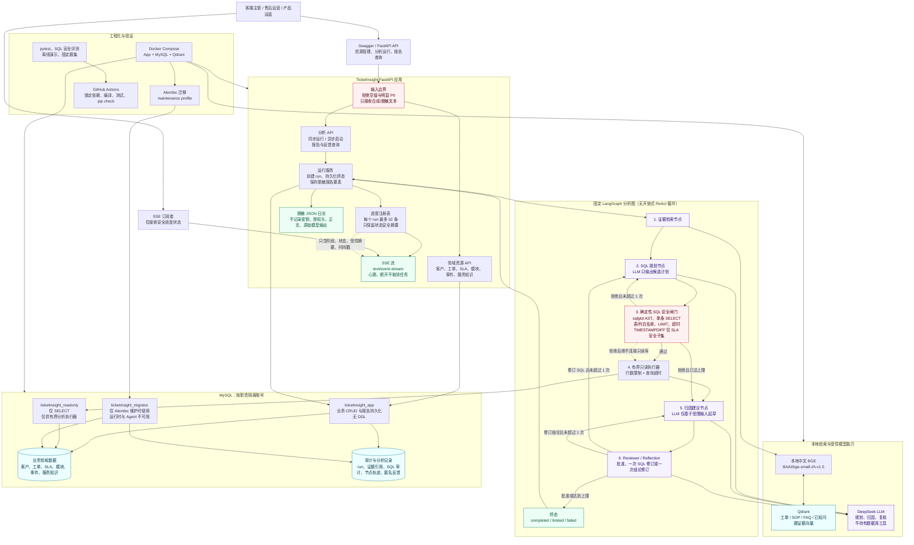
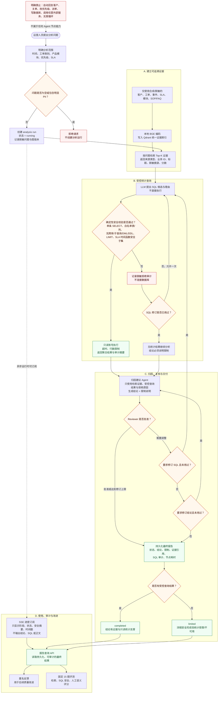

# TicketInsight 系统与业务流程图

本文档描述当前已实现的本地合成/脱敏环境。图中的 LLM 只负责理解、SQL 规划、归因和复核；它没有数据库、Shell、HTTP 或写操作工具。所有真实数据读取都必须经过确定性代码的安全校验，并使用专用只读账号。

## 系统流程图

## 业务流程图

## 阅读说明

- 实线表示正常数据或控制流；虚线表示状态通知、约束或部署关系。
- `limited` 是受控失败或受限完成的诚实状态：例如 SQL 被拒绝两次后，系统仍可基于可追溯证据给出带限制说明的分析；它不等同于查询成功。
- SSE 只提供进度，最终结论必须通过持久化报告 API 获取。这样客户端断开、进程内事件缓存淘汰都不会篡改运行结果。
- 资源 CRUD 使用业务账号；分析 SQL 只能通过只读账号。迁移账号只用于 Alembic 维护，不会注入 FastAPI 运行时或任何 Agent。
