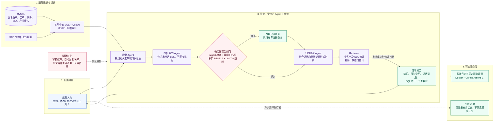

# TicketInsight：面试项目流程图

> 面试定位：一个面向客服主管、售后运营和产品运营的工单智能分析平台。它把运营问题转成“可追溯的证据检索 + 受控只读统计 + 有边界的 AI 归因”，不自动回复客户，也不执行任何业务写操作。

## 面试时的 60 秒讲解

“TicketInsight 解决的是运营人员无法快速回答‘某类投诉为什么增加、哪些工单超 SLA、某模块问题是否集中’的问题。我先用合成且脱敏的客户、工单、SLA、事件和 SOP/FAQ 建立领域数据，再用本地中文 BGE 和 Qdrant 把工单与知识统一成可检索证据。

当运营人员提问时，固定的 LangGraph 工作流先检索证据，再由模型提出统计 SQL。模型没有数据库权限，候选 SQL 必须先通过 sqlglot AST 校验：只允许单条 SELECT、白名单表和字段、LIMIT 与超时；通过后才使用专用 MySQL 只读账号执行。随后模型基于受控查询结果和证据形成归因建议，并由 Reviewer 最多进行一次 SQL 或结论修订。

最终报告保留结论、限制说明、证据引用、SQL 审计和耗时；SSE 只提供脱敏进度。这样既利用了 LLM 的理解和表达能力，也把数据读取范围和安全性牢牢交给确定性代码。”

## 可如实陈述的验证证据

- 本机 Docker 环境中已验证 MySQL、Qdrant、FastAPI、本地 BGE、受控只读查询、SSE 和固定 LangGraph 工作流。
- 固定 15 条合成运营题的真实模型基线：13 条 `completed`、2 条 `limited`、0 条 `failed`；SQL 安全评测为 19/19。
- 本地测试为 51 项通过；GitHub Actions 在干净 Ubuntu 环境完成依赖安装、编译检查、测试与 `pip check`。
- 这些结果只代表合成/脱敏环境；没有接入真实客服数据，也尚未形成已填写的人工语义质量评分。

## 不应夸大的内容

- 不说“生产可用”或“已提升客服效率”，因为尚未进行生产部署和真实业务评估。
- 不说“模型结论准确率”，因为人工语义评分模板虽已具备，但尚未完成 15 题评分。
- 不说“AI 可自动处理工单”，因为项目明确禁止自动回复、关单、派单、改优先级和写操作。
